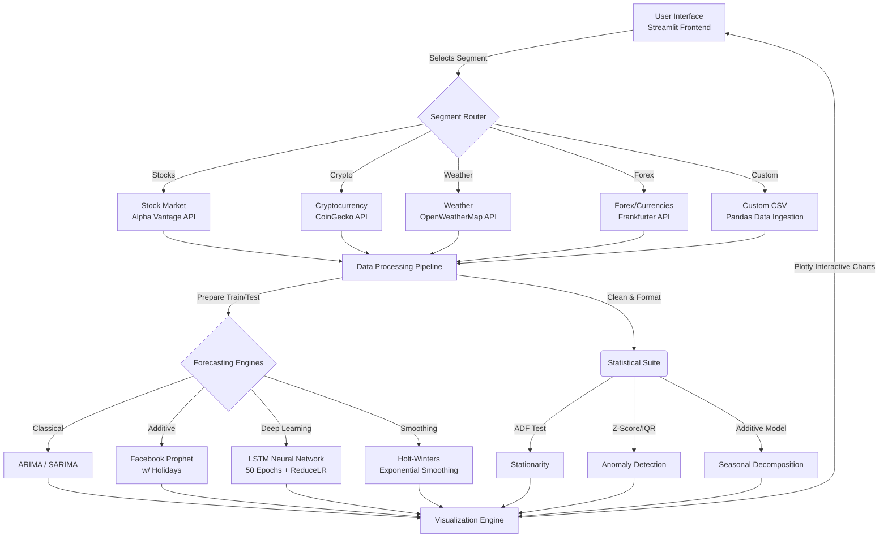

# TimeSeries Pro - Implementation Plan & Architecture

This document outlines the architecture, features, and deployment plan for the multi-segment time series platform.

---

## 🏗️ Architecture Flowchart



---

## 🎯 Final Project Specifications

### 1. The Core Application
A comprehensive, production-ready Streamlit dashboard featuring a sleek dark-mode UI, custom KPI metric cards, and highly interactive Plotly graphs.

### 2. Live Data Segments
1. **Stock Market:** Integrated with Alpha Vantage API for daily tracking and moving averages.
2. **Cryptocurrency:** Integrated with CoinGecko (100% Free API) for tracking trending tokens and historical market caps.
3. **Weather:** Integrated with OpenWeatherMap for live city-based forecasting and environmental analysis.
4. **Forex (Currencies):** Replaced the Energy segment with a robust Forex tracker using the open-source Frankfurter API (No API key required).
5. **Custom CSV:** A highly resilient file ingestion pipeline allowing users to upload personal datasets, auto-detect dates, and run predictive modeling on any numerical column.

### 3. Forecasting Models
The platform is equipped with four distinct forecasting algorithms to handle any type of data pattern:
*   **ARIMA / SARIMA:** Statistical modeling for stationary data.
*   **Facebook Prophet:** Optimized with US Holiday tracking for highly seasonal business/financial data.
*   **LSTM Neural Networks:** Built with TensorFlow. Hardened with 50-epoch training cycles and `ReduceLROnPlateau` for highly dynamic weight adjustments.
*   **Exponential Smoothing (Holt-Winters):** Classical statistical smoothing initialized with `use_boxcox` for error-free trend tracking.

### 4. Analytical Utilities
*   **Stationarity Testing:** Augmented Dickey-Fuller (ADF) tests to mathematically prove dataset stability.
*   **Anomaly Detection:** Automated Z-score outlier detection to highlight unnatural market/weather spikes.
*   **Seasonal Decomposition:** Separates time series into exact Trend, Seasonality, and Residual components.

---

## 🚀 Deployment Plan

**Platform:** Streamlit Community Cloud (free, easy, purpose-built)

### Steps to Deploy:
1. **Version Control:** Push the entire project folder to a public or private GitHub repository.
2. **Connect to Streamlit:** Log in to [Streamlit Community Cloud](https://share.streamlit.io/) and link your GitHub account.
3. **Deploy App:** Click "New App", select your repository, and set the main file path to `app.py`.
4. **Configure Secrets:** Once deployed, go to the app's Advanced Settings -> Secrets on the Streamlit dashboard and securely paste your API keys:
   ```toml
   ALPHA_VANTAGE_API_KEY = "your_key_here"
   OPENWEATHER_API_KEY = "your_key_here"
   ```
5. **Launch:** The app will instantly build the Python environment using your `requirements.txt` and go live globally!

---

## ✅ Implementation Status
- [x] Project architecture and file structure initialized.
- [x] Custom dark-mode UI and Streamlit config implemented.
- [x] Robust API clients established with fallback synthetic data for maximum uptime.
- [x] Advanced deep learning (LSTM) and statistical algorithms integrated and optimized.
- [x] Final UI refinement, exception handling, and code hardening completed.
- **Status: 100% Complete & Ready for Deployment.**
